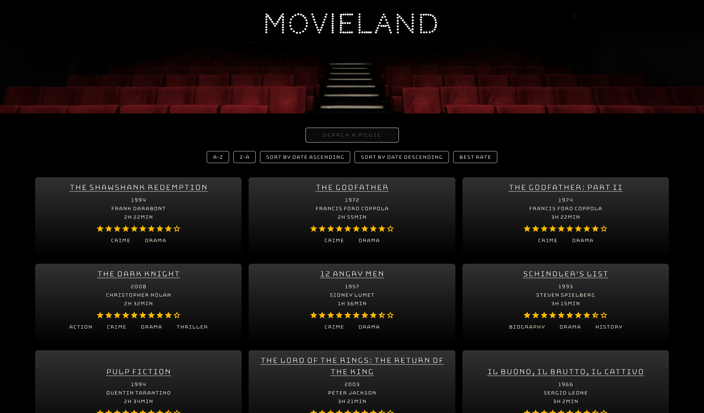
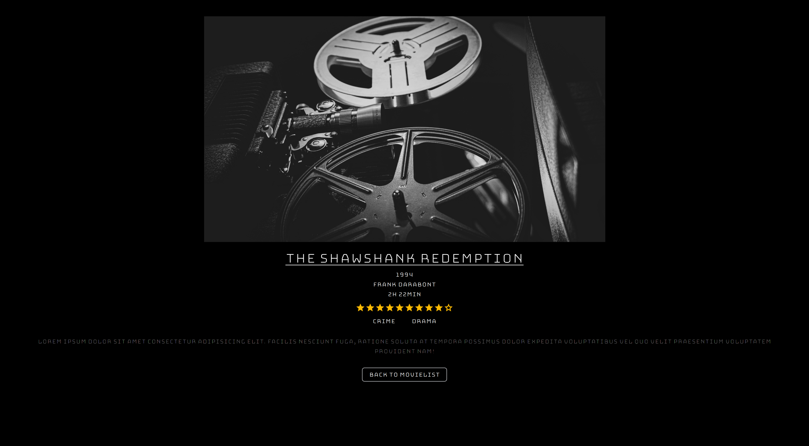
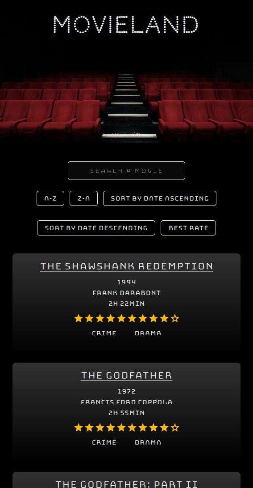
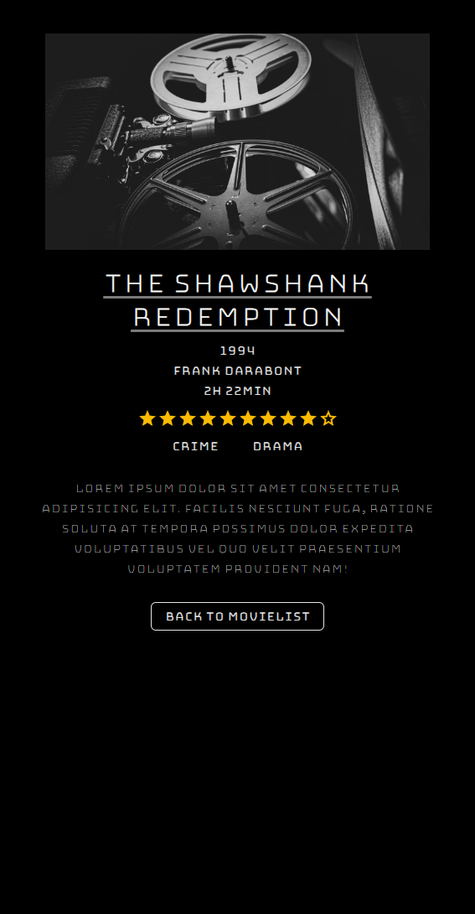

<h1 align="center"><samp>MovieLand Project</samp> </h1>

 
  
  
  

<h3><samp>Build with:</samp></h3>
<ul>
<li><samp>ReactJS Vite</samp></li>
<li><samp>Tailwind</samp></li>
<li><samp>JavaScript</samp></li>
<li><samp>HTML5</samp></li>
</ul>

<h3><samp>Features:</samp></h3>
<ul>
<li><samp>Responsive for desktop and tablet and mobile</samp></li>
<li><samp>Hover effects</samp></li>
<li><samp>Flexbox</samp></li>
<li><samp>Made with local database</samp></li>
<li><samp>Dynamic Detail Page for each Movie</samp></li>
</ul>

<h2><samp>Screenshot</samp></h2>

  

 

  

